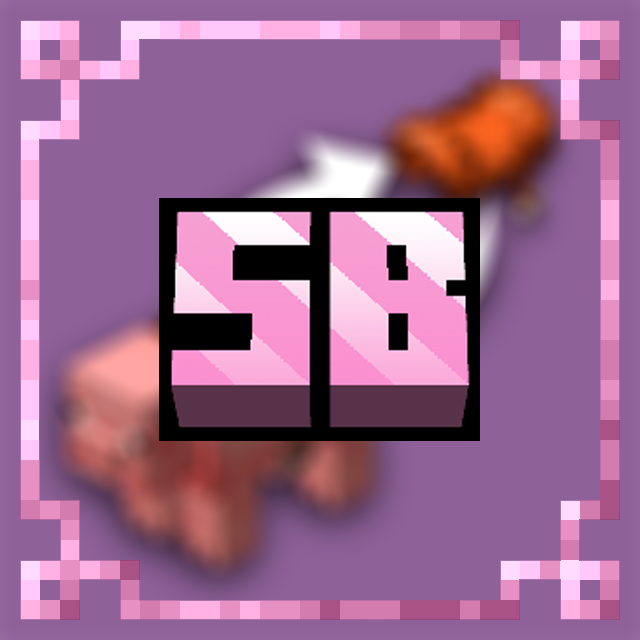

# SaddleBack

## 📖 Description / Описание

[en] Have you ridden a pig and a strider? Did you want to take the saddle because it is a valuable resource? With this datapack you can do it!

[ru] Вы катались на свинье и страйдере? Вы хотели забрать седло, потому что это ценный ресурс? С этим датапаком вы сможете это сделать!

## ✨ Features / Возможности

[en] **Sneak** with an **empty hand** and click on a saddled **pig** or **strider** to take the saddle back

[ru] **Присядьте** с **пустой рукой** и нажмите на осёдланную **свинью** или **страйдера**, чтобы забрать седло обратно

## 📥 Installation / Установка

[en] To install the datapack, place the datapack zip file in the `datapacks` folder of your world. If you are installing a mod, then place the jar file of the mod in the `.minecraft/mods` folder

[ru] Чтобы установить датапак, поместите zip-файл датапака в папку `datapacks` вашего мира.
Если вы устанавливаете мод, поместите jar-файл мода в папку `.minecraft/mods`

---

  <a href="https://play2go.cloud/?ref_id=axxR5TvWdII">
    
